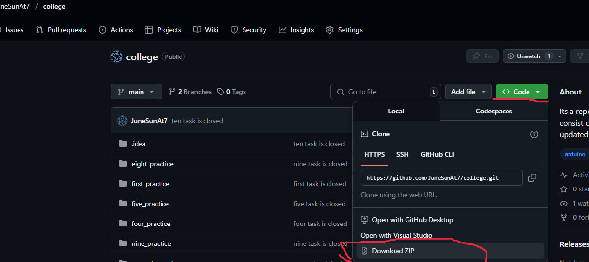

# архив скачивается так

# в целом нужно перевести на русский комменты и все вводы выводы

## 1 практическая
### в array alg файле не обязательно выполнять все алгоритмы обработки массива

## 3 практическая
### example.txt другой текст закинуть(ну и прогнать скрипт)

## 4 практическая
### файлы companies.csv companies_fixed.csv и companies_excel.xlsx остаются неизменными а updated_data переписывается скриптом json_handler

## 5 практическая
### вместо класса можно использовать функции, зациклив функцию с меню постоянно возвращаться после выбранных операций к меню и снова запрашивать действие

## 7 практическая
### еще по моему есть файл 3.3, загружу с ноута. в целом 3.2 можно сделать аккуратнее, сохранив топологии

## 8 9 10 практическая
### можно ничего не менять, эти работы я ему не сдавала

